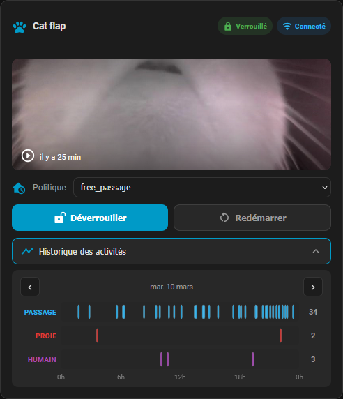

# OnlyCat Card

[](https://github.com/hacs/integration)

A custom [Home Assistant](https://www.home-assistant.io/) Lovelace card to monitor
and control your **OnlyCat** smart cat flap via the
[onlycat-home-assistant](https://github.com/OnlyCatAI/onlycat-home-assistant)
integration.



---

## Features

| Feature              | Description                                           | Entity used                                                  |
| -------------------- | ----------------------------------------------------- | ------------------------------------------------------------ |
| 📷 Camera snapshot   | Last activity video, tap to open full-screen modal    | `camera.<device_id>_last_activity_video`                     |
| 🖼️ Image snapshot    | Last activity photo, tap to open full-screen modal    | `image.<device_id>_last_activity_image`                      |
| 🔒 Lock status       | Color-coded pill, reflects physical lock state        | `binary_sensor.<device_id>_lock`                             |
| 📡 Connectivity      | Online / offline pill                                 | `binary_sensor.<device_id>_connectivity`                     |
| 🚪 Door policy       | Drop-down selector (Allow / Block / Outdoor / Indoor) | `select.<device_id>_policy`                                  |
| 🔓 Unlock button     | One-tap unlock                                        | `button.<device_id>_unlock`                                  |
| 🔄 Reboot button     | Reboot with confirmation dialog                       | `button.<device_id>_reboot`                                  |
| 📊 Activity timeline | Collapsible day-by-day frise with zoom                | `binary_sensor.<device_id>_event` · `_contraband` · `_human` |

### Activity timeline detail

- **3 rows**: Passage (flap), Prey detected, Human detected — each as a colored timeline bar.
- **Calendar-day navigation** with ◄ ► arrows to browse past days.
- **Hover tooltip** on each bar shows start time, end time and duration.
- **Zoom overlay** on hover: 30× magnification window centered on the hovered event, with ◄ ► buttons to navigate to the previous/next event without leaving the zoom.

---

## Installation

### HACS (recommended)

1. Add this repository to HACS as a custom **Frontend** repository.
2. Search for **OnlyCat Card** and install it.
3. HACS automatically registers the JS resource.

---

## Configuration

### Minimal

```yaml
type: custom:onlycat-home-assistant-card
device_id: oc_0cbfb5801849
```

### Full options

```yaml
type: custom:onlycat-home-assistant-card
device_id: oc_0cbfb5801849 # Required — your OnlyCat device ID
name: "Cat flap" # Optional — card title
show_title: true # Optional — show the card title bar (default: true)
```

All entity IDs (`camera.*`, `image.*`, `binary_sensor.*`, `select.*`, `button.*`) are
derived automatically from `device_id` — no manual entity mapping required.

---

## License

MIT
