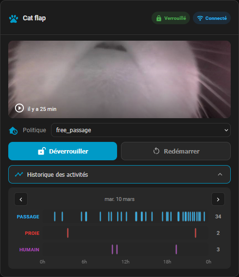

# OnlyCat Card

[](https://github.com/hacs/integration)

A custom [Home Assistant](https://www.home-assistant.io/) Lovelace card to monitor
and control your **OnlyCat** smart cat flap via the
[onlycat-home-assistant](https://github.com/OnlyCatAI/onlycat-home-assistant)
integration.



---

## Features

| Feature              | Description                                           | Entity used                                                  |
| -------------------- | ----------------------------------------------------- | ------------------------------------------------------------ |
| 📷 Camera snapshot   | Last activity video, tap to open full-screen modal    | `camera.<device_id>_last_activity_video`                     |
| 🖼️ Image snapshot    | Last activity photo, tap to open full-screen modal    | `image.<device_id>_last_activity_image`                      |
| 🔒 Lock status       | Color-coded pill, reflects physical lock state        | `binary_sensor.<device_id>_lock`                             |
| 📡 Connectivity      | Online / offline pill                                 | `binary_sensor.<device_id>_connectivity`                     |
| 🚪 Door policy       | Drop-down selector (Allow / Block / Outdoor / Indoor) | `select.<device_id>_policy`                                  |
| 🔓 Unlock button     | One-tap unlock                                        | `button.<device_id>_unlock`                                  |
| 🔄 Reboot button     | Reboot with confirmation dialog                       | `button.<device_id>_reboot`                                  |
| 📊 Activity timeline | Collapsible day-by-day frise with zoom                | `binary_sensor.<device_id>_event` · `_contraband` · `_human` |
| ↔️ Entry / exit      | Each passage colored by direction, with the pet's name | `binary_sensor.<device_id>_event` (`direction`, `action`, `rfidCode`) |
| 🐈 Pets              | Inside / outside chip per pet, and one timeline row each | `device_tracker.<rfid>_tracker`                            |

### Activity timeline detail

- **Rows**: Passage (flap), one row per pet, Prey detected, Human detected.
- **Direction**: passages are green for an entry and orange for an exit; a
  passage that didn't go through (the integration's `action` other than
  `TRANSIT`) is drawn hollow with a dashed outline. Passages without an event
  summary stay blue.
- **Pet rows**: a light band shows when the pet was outside, with that pet's
  passages on top. The hover tooltip and the zoom show the direction and which
  pet went through.
- **Calendar-day navigation** with ◄ ► arrows to browse past days.
- **Hover tooltip** on each bar shows start time, end time and duration.
- **Zoom overlay** on hover: 30× magnification window centered on the hovered event, with ◄ ► buttons to navigate to the previous/next event without leaving the zoom.

---

## Installation

### HACS (recommended)

1. Add this repository to HACS as a custom **Frontend** repository.
2. Search for **OnlyCat Card** and install it.
3. HACS automatically registers the JS resource.

---

## Configuration

### Minimal

```yaml
type: custom:onlycat-home-assistant-card
device_id: oc_0cbfb5801849
```

### Full options

```yaml
type: custom:onlycat-home-assistant-card
device_id: oc_0cbfb5801849 # Required — your OnlyCat device ID
name: "Cat flap" # Optional — card title
show_title: true # Optional — show the card title bar (default: true)
show_pets: true # Optional — show the per-pet inside/outside chips (default: true)
pets: # Optional — defaults to every named OnlyCat pet tracker
  - device_tracker.900123000000001_tracker
  - entity: device_tracker.900123000000002_tracker
    name: Filou # Optional — defaults to the tracker's name
    color: "#7e57c2" # Optional
```

The integration creates a tracker for every chip it reads, including visitors
that aren't registered in the OnlyCat app. Those have no name (the tracker is
named after the chip code), so auto-discovery leaves them out. The timeline then
only shows passages by your cats: visitors' passages, and passages where no
chip was read, are hidden. List a visitor under `pets` to show it anyway.
Without any cat to match (integration older than v2.0.7), every passage is
shown.

Entry/exit and per-pet data need version **2.0.7** or later of the integration,
which adds the event summary (`direction`, `action`, `rfidCode`) to the flap
event sensor. With older versions, passages are simply shown without a
direction.

Timeline colors can be themed with `--history-in-color`,
`--history-out-color`, `--history-flap-color`, `--history-contraband-color` and
`--history-human-color`.

All entity IDs (`camera.*`, `image.*`, `binary_sensor.*`, `select.*`, `button.*`) are
derived automatically from `device_id` — no manual entity mapping required.

---

## License

MIT
